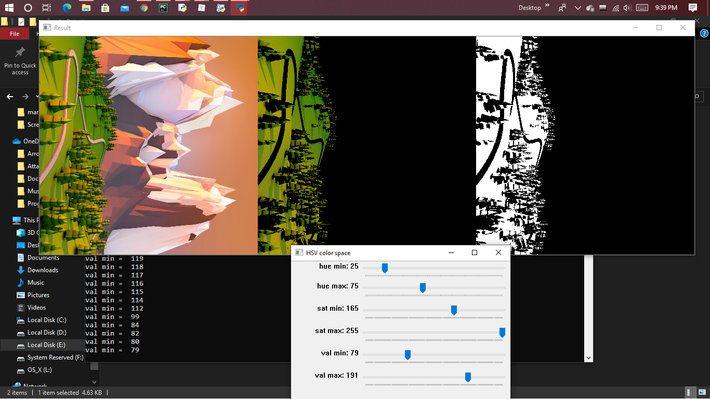

# Color detection using HSV color 

Only hold that color in mask image which we want to track and move track Bar according to it

<<<<<<< HEAD
HSV[HUE Saturation Value]

```
HUE = color
saturation = how pure color is
value= how bright color is
```


=======

>>>>>>> origin/main



